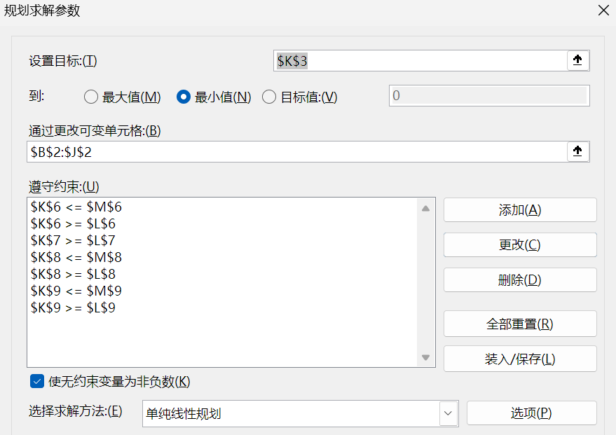
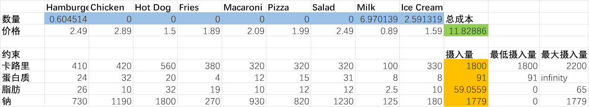
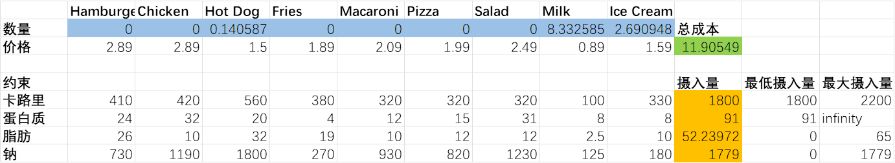
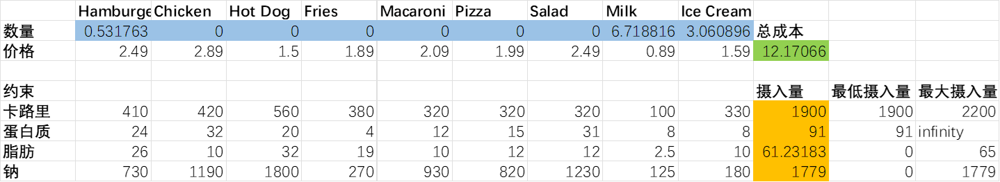
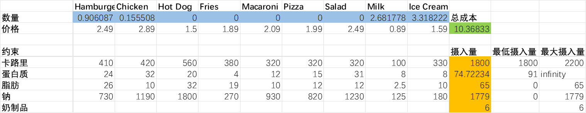
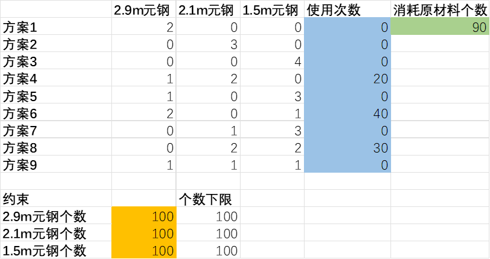

# 作业一

冼名儒 2300017466

## 1.

**饮食问题：世界健康组织（WHO）对一个成年人每日营养摄入量的相关建议如表3所示。小明同学想要在满足营养摄入量需求的基础上，尽可能减少在食物上的花费。其所喜爱的各种食物的单位价格及对应的营养成分表分别如表1和表2所示。请帮助小明确定其饮食方案。（注：暂时忽略整数情形，假设可以购买非整数单位的食物，如1.5单位的Hot Dog等）**

### (a)

**上述问题是否可以建模为一个线性规划问题？若能请写出其决策变量、目标函数及约束条件。若不能请说明理由。**

可以。

决策变量如下：

| 食物      | 变量  |
| --------- | ----- |
| Hamburger | $x_1$ |
| Chicken   | $x_2$ |
| Hot Dog   | $x_3$ |
| Fries     | $x_4$ |
| Macaroni  | $x_5$ |
| Pizza     | $x_6$ |
| Salad     | $x_7$ |
| Milk      | $x_8$ |
| Ice Cream | $x_9$ |

目标函数：
$$
\min_{x_i} 2.49x_1+2.89x_2+1.50x_3+1.89x_4+2.09x_5+1.99x_6+2.49x_7+0.89x_8+1.59x_9
$$
约束条件：
$$
410x_1 + 420x_2 + 560x_3 + 380x_4 + 320x_5 + 320x_6 + 320x_7 + 100x_8 + 330x_9 \ge 1800 \\
410x_1 + 420x_2 + 560x_3 + 380x_4 + 320x_5 + 320x_6 + 320x_7 + 100x_8 + 330x_9 \le 2200 \\
24x_1 + 32x_2 + 20x_3 + 4x_4 + 12x_5 + 15x_6 + 31x_7 + 8x_8 + 8x_9 \ge 91 \\
26x_1 + 10x_2 + 32x_3 + 19x_4 + 10x_5 + 12x_6 + 12x_7 + 2.5x_8 + 10x_9 \le 65 \\
730x_1 + 1190x_2 + 1800x_3 + 270x_4 + 930x_5 + 820x_6 + 1230x_7 + 125x_8 + 180x_9 \le 1779 \\
x_i \ge 0 \quad (i=1,2,\ldots,9)
$$

### (b)

**请应用Excel对该问题进行求解，并回答小明的最优饮食组合和最小花费分别如何？请将Excel截图插入到回答中。**





### (c)

**请尝试采用Python + Gurobi 对上述问题再次进行求解，请将代码及运行结果截图插入回答中。**

```python
import gurobipy as gp
from gurobipy import GRB

# 9 food items in the problem
prices = [2.49, 2.89, 1.50, 1.89, 2.09, 1.99, 2.49, 0.89, 1.59]

# Constraints coefficients by nutrient
calories = [410, 420, 560, 380, 320, 320, 320, 100, 330]
protein = [24, 32, 20, 4, 12, 15, 31, 8, 8]
fat = [26, 10, 32, 19, 10, 12, 12, 2.5, 10]
sodium = [730, 1190, 1800, 270, 930, 820, 1230, 125, 180]

try:
    m = gp.Model("diet_problem")
    x = m.addVars(9, lb=0.0, name="x")

    # Objective
    m.setObjective(gp.quicksum(prices[i] * x[i] for i in range(9)), GRB.MINIMIZE)

    # Constraints
    m.addConstr(gp.quicksum(calories[i] * x[i] for i in range(9)) >= 1800, "cal_min")
    m.addConstr(gp.quicksum(calories[i] * x[i] for i in range(9)) <= 2200, "cal_max")
    m.addConstr(gp.quicksum(protein[i] * x[i] for i in range(9)) >= 91, "prot_min")
    m.addConstr(gp.quicksum(fat[i] * x[i] for i in range(9)) <= 65, "fat_max")
    m.addConstr(gp.quicksum(sodium[i] * x[i] for i in range(9)) <= 1779, "sod_max")

    m.optimize()

    if m.status == GRB.OPTIMAL:
        print("最优目标值(最小花费):", m.objVal)
        print("最优组合(x):")
        for i in range(9):
            if x[i].x > 1e-9:
                print(f"  x{i+1} = {x[i].x:.6f}")
        print("各约束值:")
        print("  calories=", sum(calories[i] * x[i].x for i in range(9)))
        print("  protein=", sum(protein[i] * x[i].x for i in range(9)))
        print("  fat=", sum(fat[i] * x[i].x for i in range(9)))
        print("  sodium=", sum(sodium[i] * x[i].x for i in range(9)))
    else:
        print("模型没有找到最优解，状态码", m.status)

except gp.GurobiError as e:
    print("Gurobi 错误:", e)
except Exception as e:
    print("其他错误:", e)
```

```bash
最优目标值(最小花费): 11.828861111111111
最优组合(x):
  x1 = 0.604514
  x8 = 6.970139
  x9 = 2.591319
各约束值:
  calories= 1800.0
  protein= 91.0
  fat= 59.055902777777774
  sodium= 1779.0
```

### (d)

**若Hamburger价格变为2.89，是否会对（b）、（c）求得的最优解有影响？**



汉堡数量变为0，热狗、牛奶和冰淇淋的数量上升。

### (e)

**若WHO调整对卡路里的最低需求量为1900，会对（b）、（c）中求解得到的最优解有何影响？**



汉堡和牛奶的数量减少，冰淇淋数量上升。

### (f)

**若要求奶制品（包含Milk和Ice Cream）的摄入量不能超过6单位，会对上述最优解产生什么影响？**




## 2.

**原料规划问题：现要做100套钢架，每套用长为2.9m，2.1m和1.5m的元钢各一根。已知原料长7.4m，问应如何下料，使用的原材料最省。（注：可暂时忽略整数约束，亦可自行探索如何加入整数约束**）

考虑多种切割组合：

| 方案 $i$ | $a_i$ (2.9m) | $b_i$ (2.1m) | $c_i$ (1.5m) | 实际用料 | 剩余废料 |
| :------: | :----------: | :----------: | :----------: | :------: | :------: |
|    1     |      2       |      0       |      0       |   5.8    |   1.6    |
|    2     |      0       |      3       |      0       |   6.3    |   1.1    |
|    3     |      0       |      0       |      4       |   6.0    |   1.4    |
|    4     |      1       |      2       |      0       |   7.1    |   0.3    |
|    5     |      1       |      0       |      3       |   7.4    |   0.0    |
|    6     |      2       |      0       |      1       |   7.3    |   0.1    |
|    7     |      0       |      1       |      3       |   6.6    |   0.8    |
|    8     |      0       |      2       |      2       |   7.2    |   0.2    |
|    9     |      1       |      1       |      1       |   6.5    |   0.9    |

决策变量：设每一种方案的使用次数为$x_i$

优化目标：
$$
\min \sum_{i=1}^9 x_i
$$
约束条件：
$$
2x_1 + x_4 + x_5 + 2x_6 + x_9 \ge 100 \\
3x_2 + 2x_4 + x_7 + 2x_8 + x_9 \ge 100 \\
4x_3 + 3x_5 + x_6 + 3x_7 + 2x_8 + x_9 \ge 100 \\
x_i \ge 0 \quad (i=1,2,\ldots,9)
$$


我发现上面这个结果不是唯一解。事实上，只要满足下面的关系，都可作为解：
$$
x_4=t,x_5=t−20,x_6=60−t,x_8=50−t,20≤t≤50
$$
