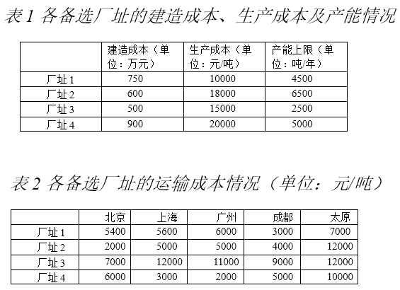
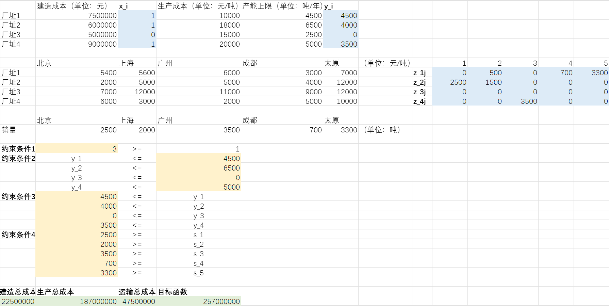
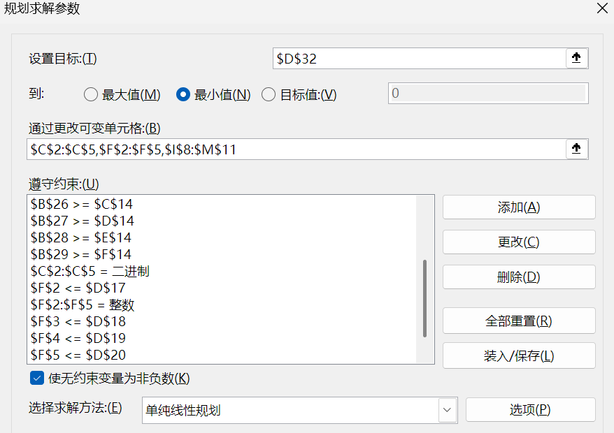

# 作业二

冼名儒 2300017466

**A公司食品团队研发出了一种新型饮品，一经推出便广受欢迎，现拟建造工厂进行大规模生产。经市场分析，该饮品将主要销往国内的五大市场：北京、上海、广州、成都和太原。 市场调研表明，该饮品预计年销售量为12000吨，其中北京2500吨、上海2000吨、广州3500吨、成都700吨、太原3300吨。该团队目前正面临生产工厂建设筹备及饮品的生产和分销计划制定问题。 经调研后共有四个备选厂址，各厂址的建设成本、生产成本和产能上限如表1所示。各备选厂址与五大市场间的运输成本如表2所示。作为A公司运筹优化团队的核心成员，现请你帮助该团队制定一个详细的计划，计划中需包含厂址建造决策情况、各工厂生产计划及运输分配情况。该团队的决策目标为总成本最小化。**

### (a)

**该问题是否可建模为一个整数规划问题？若能请详细写出该问题的决策变量、目标函数及约束条件，若不能请说明理由。**

可以。

变量：

| 决策变量               | 含义                   |
| ---------------------- | ---------------------- |
| $x_i (i=1,...,4)$      | 是否选择工厂i          |
| $y_i (i = 1,...,4)$    | 工厂i生产的饮品数      |
| $z_{ij} (j = 1,...,5)$ | 工厂i运到城市j的饮品数 |

| 状态变量               | 含义                 |
| ---------------------- | -------------------- |
| $c_i (i=1,...,4)$      | 工厂i的建造成本      |
| $p_i (i = 1,...,4)$    | 工厂i的生产成本      |
| $t_{ij} (j = 1,...,5)$ | 工厂i运到城市j的成本 |
| $l_i (i = 1,...,4)$    | 工厂i的产能上限      |
| $s_j (j = 1,...,5)$    | 城市j的预计销售量    |

目标函数：
$$
\min_{x_i,y_j} \sum_i c_ix_i + \sum_i p_iy_i + \sum_i\sum_j t_{ij}z_{ij}
$$
约束条件：

工厂至少选1个。
$$
\sum_i x_i \ge 1 \\
x_i \text{ binary}
$$
产量为非负数，且只有建造了工厂才能开始生产。
$$
y_i \ge 0 \\
y_i \le x_il_i \\
y_i \text{ int}
$$
工厂i的运输总量不得超过生产总量。
$$
\sum_j z_{ij} \le y_i
$$
运往城市j的饮品数要满足当地需求量。
$$
\sum_i z_{ij} \ge s_j \\
z_{ij} \text{ int}
$$

### (b)

**请应用Excel或Gurobipy对上述问题进行求解，请写明详细求解过程并报告最优解。 **

**最小成本：**257,000,000

**选址：**$x_1 = 1, x_2 = 1, x_3 = 0, x_4 = 1$

**生产饮料数：**$y_1 = 4500, y_2 = 4000, y_3 = 0, y_4 = 3500$

**运输饮料数：**

- 工厂1：$z_{11} = 0, z_{12} = 500, z_{13} = 0, z_{14} = 700, z_{15} = 3300$
- 工厂2：$z_{21} = 2500, z_{22} = 1500, z_{23} = 0, z_{24} = 0, z_{25} = 0$
- 工厂3：$z_{31} = 0, z_{32} = 0, z_{33} = 0, z_{34} = 0, z_{35} = 0$
- 工厂4：$z_{41} = 0, z_{42} = 0, z_{43} = 3500, z_{44} = 0, z_{45} = 0$