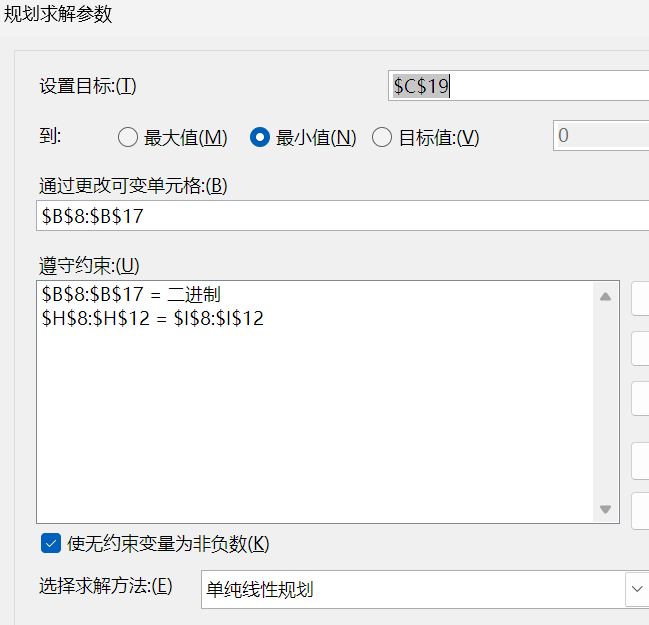
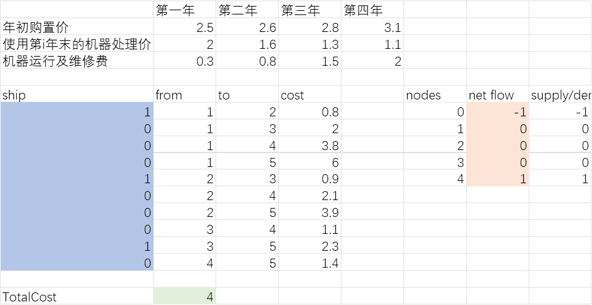

## 作业三

冼名儒 2300017466

**某工厂主要应用某加工机器进行生产，该类机器最多可连续工作4年。在此期间，每年年底工厂可以第二年继续使用该机器，也可于年末卖掉，换一台新的。已知于各年初购置一台新机器的价格及不同役龄机器年末的处理价格、年度运行及维修费用如表1所示。请帮助该工厂确定该机器的最优更新策略，使4年内都有机器可用，且购买、更换、及运行维修的总费用最少。**

表 1 机器购置、使用及处理相关费用信息

|                         | 第一年 | 第二年 | 第三年 | 第四年 |
| ----------------------- | ------ | ------ | ------ | ------ |
| 年初购置价              | 2.5    | 2.6    | 2.8    | 3.1    |
| 使用第i年末的机器处理价 | 2.0    | 1.6    | 1.3    | 1.1    |
| 机器运行及维修费        | 0.3    | 0.8    | 1.5    | 2      |

### (1)

**该问题是否可以建模为一个网络流问题？若是请给出具体建模形式，若不是请说明理由。**

可以。

假设：

- 节点$node_i$为第i年末、第i+1年初。起点为$node_0$，终点为$node_4$，$node_0$供给为1，$node_4$需求为1.

- 边$edge_{ij}$为第i年初购买机器到第j年初卖出（j > i）。$x_{ij}$是二元变量，等于1表示通过边，等于0表示不通过边。

  这里的设定使得$edge_{ij}$连接的不是$node_i$和$node_j$，而是$node_{i-1}$和$node_{j-1}$.

- 边成本$c_{ij} = PurchasePrice_{i+1} + \sum_{t=1}^{j-i} OperatingCost_t + SalvageValue_{j-i}$

目标函数：
$$
\min_{x_{ij}} \sum_{i=1}^4 \sum_{j=i+1}^{5} c_{ij}x_{ij}
$$
约束条件：

- node 0: $1 = x_{12} + x_{13} + x_{14} + x_{15}$
- node 1: $x_{12} = x_{23} + x_{24} + x_{25}$
- node 2: $x_{13} + x_{23} = x_{34} + x_{35}$
- node 3: $x_{14} + x_{24} + x_{34} = x_{45}$
- node 4: $x_{15} + x_{25} + x_{35} + x_{45} = 1$
- $x_{ij}$ is binary

### （2）

**请应用Excel Solver 或者 Gurobipy求解该问题，请展示求解过程并及给出最优方案。**

**结论：**用三台机器，1 - 2，2 - 3，3 - 5，成本共计4.
